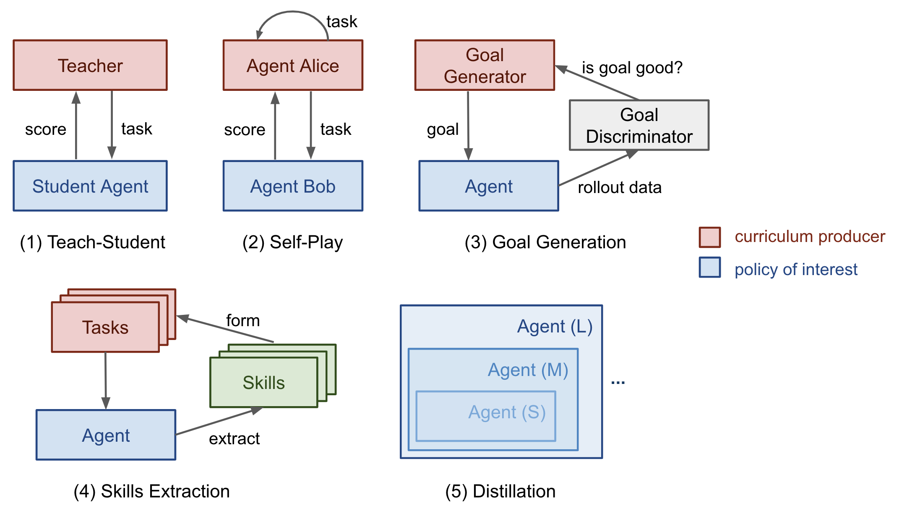
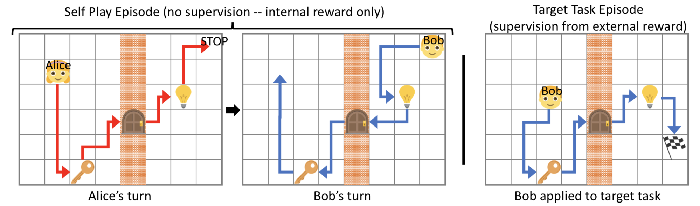
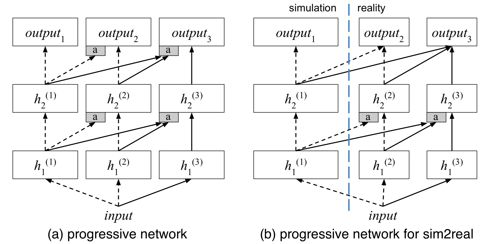
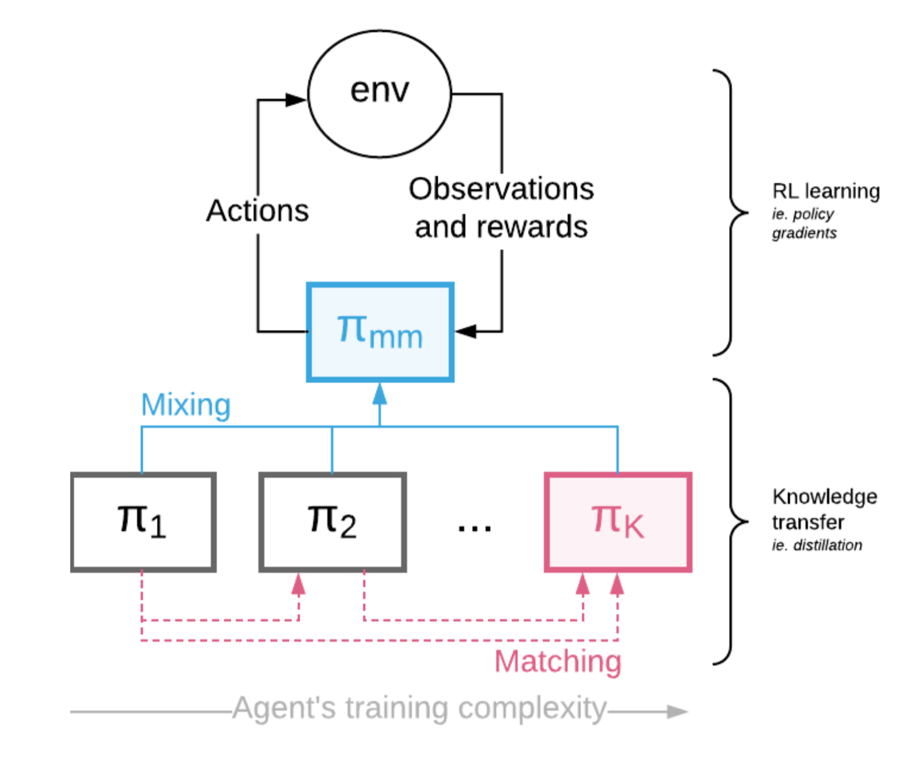

# Curriculum for Reinforcement Learning

## Task-Specific Curriculum

What could be the general principles that make some curriculum strategies work better than others?

The Bengio 2009 paper hypothesized it would be beneficial to make learning focus on "interesing" examples that are neither too hard or too easy.

 

We need a way to quantify the difficulty of a task first.

If our naive curriculum is to train the model on samples with a gradually increasing level of complexity, we need a way to quantify the difficulty of a task first.

One idea is to use its minimal loss with respect to another model while this model is pretrained on the other tasks.

 

Zaremba & Sutskever did an interesting experiment on training LSTM to predict the output of a short Python program for mathematical ops without actually executing the code.

- Naive curriculum: increase `length` first until reaching `a`; then increase `nesting` and reset `length` to 1; repeat this process until both reach maximum.
- Mix curriculum: sample `length` ~ [1, a] and `nesting` ~ [1, b]
- Combined: naive + mix

They noticed that combined strategy always outperformed the naive curriculum and would generally (but not always) outperform the mix strategy.

 

RL policy can easily overfit to a specific game but training over a simple curriculum that grows the task difficulty together with the model performance helps its generalization to new human-design levels.

We can check the details in [Meta RL post](https://lilianweng.github.io/posts/2019-06-23-meta-rl/#evolutionary-algorithm-on-environment-generation).

 

To folow the curriculum learning approaches described above, generally we need to figure out two problems in the training procedure:

1. Design a metric quantify how hard a task is so that we can sort tasks accordingly.
2. Provide a sequence of tasks with an increasing level of difficulty to the model during training.

However, the order of tasks does not have to be sequential. In [OpenAI's cube paper](https://arxiv.org/abs/1910.07113), Automatic Domain Randomization (ADR) to generate a curriculum by growing a distribution of environments with increasing complexity.

 

## Teacher-Guided Curriculum

The idea of Automatic Curriculum Learning was proposed by [Graves, et al. 2017](https://arxiv.org/abs/1704.03003).

Two categories of learning signals have been considered in the paper:

1. Loss-driven progress: the loss function change before and after one gradient update. This type of reward signals tracks the speed of the learning process. (becuase the gratest task loss decrease is equivalent to the fastest learning)
2. Complex-driven progress: the KL divergence between posterior and prior distribution over network weights. Increasing the model complexity by a certain amount is only worthwhile if it compresses the data by a greater amount. ([MDL](https://en.wikipedia.org/wiki/Minimum_description_length) principle) The model complexity is therefore expected to increase most in response to the model nicely generalizing to training examples.

This framework of proposing curriculum automatically through another RL agent was formalized as Teacher-Student Curriculum Learning(TSCL; [Matiisen, et al. 2017](https://arxiv.org/abs/1707.00183)).

In TSCL, a student is an RL agent working on actual tasks while teacher agent is a policy for selecting tasks.

In the process, the student should learn tasks which:

1. can help the student make fastest learning process
2. are at risk of being forgotten

Interestingly, uniformly sampling from all tasks is a surprisingly strong benchmark.

 

## Curriculum through Self-Play

[Sukhbaatar, et al. (2017)](https://arxiv.org/abs/1703.05407) proposed a framework for automatic curriculum learning through asymmetric self-play.

Two agents, Alice and Bob, play the same task with different goals: Alice challengs Bob to achieve the same state and Bob attempts to complete it as fast as he can.

- In the self-play episode, Alice alters the state from $s_0$ to $s_t$ and then Bob is asked to return the environment to its original state $s_0$ to get an internal reward.
- In the target task episode, Bob receives an external reward if he visits the target flag.

Note that since Bob has to repeat the action between the same pair of $(s_0, s_t)$ of A, this framework only works in reversible or resettable environments.

 

Bob's reward is set as $R_B = -\gamma t_B$ and Alice's reward is $R_A = \gamma \max(0, t_B - t_A)$, where $t_B$ is the total time for B to complete the task, $t_A$ is the time until Alice performs the STOP action and $\gamma$ is a scalar constant to rescale the reward to be comparable with the external task reward.

If Bob fails a task, $t_B = t_{\max} - t_A$.

The losses imply:

1. Bob wants to finish a task ASAP.
2. Alice prefers tasks that take more time of Bob.
3. Alice does not want to take too many steps when B is failing.

In this way, the interaction between Alice and Bob automatically builds a curriculum aof increasingly challenging tasks.

Meanwhile, as Alice has done the task before proposing the task to B, the task is guaranteed to be solvable.

It sound similar to the Teacher-Student framework.

However, in asymmetric self-play, Alice, who plays a teacher role, also works on the same task to find challenging cases for Bob rather than optimizes Bob's learning process explicitly.

 

## Curriculum through Distillation

The motivation for the progressive neural network ([Rusu et al. 2016](https://arxiv.org/abs/1606.04671)) architecture is to efficiently transfer learned skills between different tasks and in the meantime avoid catastrophic forgetting.

A progressive network has the following structure:

1. It starts with a single column containing $L$ layers of neurons, in which the corresponding activation layers are labelled as $h^{(1)}_i, i = 1, \ldots, L$. We first train single-column network for one task to convergence, achieving parameter config $\theta^{(1)}$.
2. Once switch to the next task, we need to add a new column to adapt to the new context while freezing $\theta^{(1)}$ to lock down the learned skills from the previous task. The new column has activation layers labelled as $h^{(2)}_i, i = 1, \ldots, L$, and parameters $\theta^{(2)}$.
3. Step 2 can be repeated with every new task. The $i$-th layer activation in the $k$-th column depends on the previous activation layers in all existing columns:

Progressive network works better than only fine-tuning the top layer and can achieve similar transfer performances as fine-tuning the entire network.

[Czarnecki, et al. (2018)](https://arxiv.org/abs/1806.01780) proposed another RL training framework, Mix & Match to provide curriculum through coping knowledge between agents.

Given a sequence of agents from simple to complex, $\pi_1, \ldots, \pi_K$, each parameterized with some shared weights (e.g. by shared some lower common layers).

Mix & Match trains a mixture of agents, but only the final performance of the most complex one $\pi_K$ matters.

In the meantime, Mix & Match a categorical distribution $c \sim \text{Categorical}(1, \ldots, K|\alpha)$ with pmf $p(c = i) = \alpha_i$ probability to pick which policy to use at a given time.

The mixed policy is a simple weighted sum: $\pi_{\text{mm}}(a|s) = \sum^k_{i = 1} \alpha_i \pi_i(a|s)$.

Curriculum learning is realized by dynamically adjusting $\alpha_i$, from $\alpha_k = 0$ to $\alpha_k = 1$.

The tuning of $\alpha$ can be manual or through [population-based training](https://lilianweng.github.io/posts/2019-09-05-evolution-strategies/#hyperparameter-tuning-pbt).

To encourage cooperation rather than competition among policies, besides the RL loss $\mathcal{L}_{\text{RL}}$, another distillation-like loss $\mathcal{L}_\text{{mm}}(\theta)$ is added.